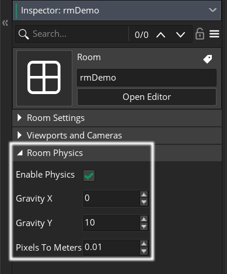
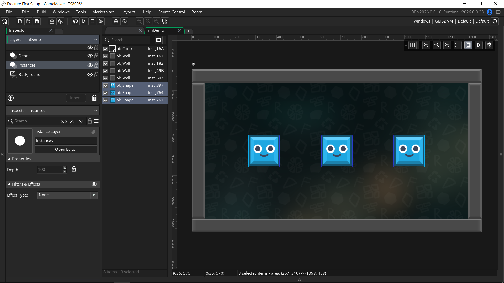
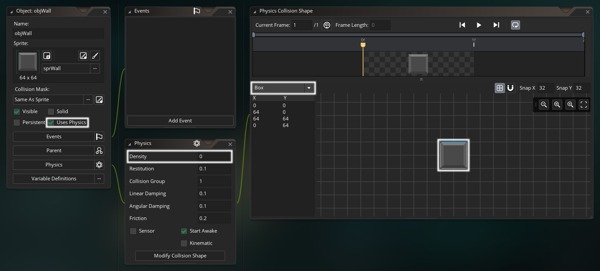
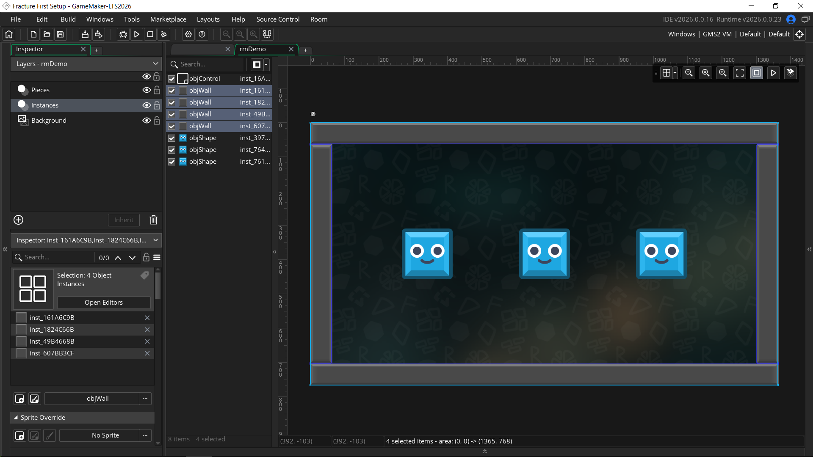

# Getting Started

## Welcome!

Welcome to Fracture! Let's get you set up and ready to break your first instance into physics-driven pieces.

We'll start by downloading and importing the `.yymps` package and preparing your project in [Installation](#installation). Then in [First Setup](#first-setup), we'll walk through fracturing your first instance and see how Fracture breaks it into Box2D pieces. By the end, you'll have a simple working example that shatters an instance when you click on it.

:::tip
Throughout this page, and the documentation as a whole, you'll see many hyperlinks to key Fracture concepts. I encourage you to explore them briefly as you get started, as they'll help you quickly understand the library's overall structure.
:::

## Requirements

* GameMaker version [LTS 2026](https://releases.gamemaker.io/release-notes/2026/0).
* Basic familiarity with GameMaker and GML, including:
    * Asset types (rooms, objects, scripts, sprites, etc).
    * Working with objects and events.
    * Structs, functions and methods, macros.
* Familiarity with GameMaker's [Box2D physics](https://manual.gamemaker.io/lts/en/GameMaker_Language/GML_Reference/Physics/Physics.htm) is recommended but not required. Fracture handles the heavy lifting, so you can pick up the basics as you go.

---

Fracture is a fairly specific library that makes some assumptions about your project and needs a bit of setup before you fracture anything. The two big ones to know upfront:
* Room Physics must be enabled in any room where Fracture is used, since Pieces are handled as Box2D bodies.
* Fractured instances must have a valid non-vector sprite assigned, and their [image_xscale](https://manual.gamemaker.io/lts/en/#t=GameMaker_Language%2FGML_Reference%2FAsset_Management%2FSprites%2FSprite_Instance_Variables%2Fimage_xscale.htm)/[image_yscale](https://manual.gamemaker.io/lts/en/#t=GameMaker_Language%2FGML_Reference%2FAsset_Management%2FSprites%2FSprite_Instance_Variables%2Fimage_yscale.htm) must be positive.

See the full [Requirements](/topics/requirements) page for the complete list before you get going, including physics world geometry, depth sorting, and scale limitations.

## Installation

First, download the `.yymps` local package from the latest [GitHub Release](https://github.com/glebtsereteli/Fracture/releases/latest).

---

Next, import the package into your project.
* Navigate to __Tools__ in the top toolbar and click __Import Local Package__, or just drag and drop the file into GameMaker.
* Locate and select the downloaded `.yymps` local package in Explorer/Finder.
* Click **Add All**, then **Import**.

:::details What's Included?
Everything lives inside the `Fracture` folder:
- **(System)** folder with internal library code. You never need to touch this.
- **Fracture** that holds the [main interface](/api/fracture/overview) you'll call all methods on.
- **Fracture Info** note with general info and links.
- **[FractureConfig](/api/config)** that holds configuration macros for tweaking defaults.
- **[FractureConstants](/api/fracture/convexFracturing#shapes)** that defines the :Shapes: constants.

The only file under **Included Files** is the [MIT license](/home/faq/#how-is-fracture-licensed-can-i-use-it-in-commercial-projects).
:::

---

You're good to go! Continue to the [First Setup](#first-setup) section below to fracture your first instance.

:::tip
If you already have Fracture installed and want to update to the latest version, check the [Updating](/home/faq#how-do-i-update-to-the-latest-version-of-fracture) :FAQ: entry for instructions.
:::

## First Setup

Let's set up a simple example. We'll fracture some non-physics :Box:-shaped instances with a few different patterns, then add an :Impulse: to send :Pieces: flying.

<Video src="./fracture3.mp4" />

> ℹ️ Download the [Fracture First Setup.yyz](https://github.com/glebtsereteli/Fracture/releases/latest/download/Fracture.First.Setup.yyz) example and poke around as you read.

### Lay The Groundwork

<div style="display: flex; gap: 1.5rem; align-items: center; margin-top: 1.5rem;">
  
  <div>

Starting from a fresh project with the library imported, we'll create the object we'll be breaking. We'll call it `objShape` and give it a simple box-shaped sprite.

  </div>
</div>

This object won't be physics-enabled itself (although it could be, Fracture supports both), but the :Pieces: it breaks into are physics-driven, so we need to enable physics in our room either [through the IDE](https://manual.gamemaker.io/lts/en/The_Asset_Editors/Room_Properties/Room_Properties.htm#physics) or [programmatically](https://manual.gamemaker.io/lts/en/GameMaker_Language/GML_Reference/Physics/The_Physics_World/physics_world_create.htm).



:::warning NO PHYSICS CRASH
If you forget to enable physics in a room where you use Fracture (or any other Box2D features), you'll get a crash saying: `The current room does not have a physics world representation`.
:::

Our shape is fairly big at 148x148, so we'll set the room's **Pixels To Meters** scale to `0.01`.

::: details Why 0.01?
Physics behavior depends on the room's **Pixels To Meters** scale. At the default `0.1`, our shape reads as ~15 meters wide, so it drifts around like a slow-moving giant instead of shattered debris.

Dropping to `0.01` makes each pixel a centimeter, putting the shape at a believable ~1.5 meters where Pieces fall and tumble the way you'd expect.
:::

---

To show that Fracture works with instances of any (positive) scale, we'll add a Create event to `objShape` and randomize its scale. Our sprite also comes with a few frames, so we'll randomize that as well.
:::code-group
```js [Create event]
/// @desc Randomize scale and frame

image_xscale = random_range(1.2, 1.5); // [!code highlight]
image_yscale = image_xscale; // [!code highlight]
image_index = irandom(image_number - 1); // [!code highlight]
```
:::

Finally, we'll drop a few instances of `objShape` in our test room.



### Take Control

We'll also make a controller object called `objControl` and place it in the room. It sets the layer Fracture renders :Pieces: on in the Create event via :.RenderAt():, and restarts the room when pressing R so we can try different fracture results without relaunching the game.

Our room has a **Debris** layer sitting just above **Instances**, so Pieces will draw in front of shapes and walls.

:::code-group
```js [Create event]
/// @desc Set Fracture rendering layer

Fracture.RenderAt("Debris"); // [!code highlight]
```
```js [Key Press - R event]
/// @desc Restart room

room_restart(); // [!code highlight]
```
:::

Pieces aren't drawn by the instances themselves. They're all rendered together in one batch by an internal renderer object, and that batch needs a single depth to sit at. :.RenderAt(): sets it by pointing at a layer in the room.

---

See [Rendering](/topics/rendering) for more details, including how the shared vertex buffer works and why Pieces can't be depth sorted against other instances.

### Set Boundaries

Before we fracture anything, our room needs something for Pieces to collide against. Without any physics geometry, Pieces would just fall straight out of the room.

We'll make a wall object called `objWall` with a simple 64x64 box sprite and check **Uses Physics** on it. The defaults are fine across the board, with one exception: we'll set **Density** to `0` so the wall stays static and never moves.



Then we'll place scaled `objWall` instances around the room to seal it in.



Now our room is sealed and any Pieces we create will collide and bounce against the walls.

### Break The Shape

Now to the fun part! 

We'll add a **Left Pressed** event to `objShape`. This is where we'll fracture the shape by clicking on it.

Let's use one of the available :Patterns: to fracture the shape. We'll go with :Grid: here, passing in the instance ID to fracture (our own `id`), the :Shape: constant (:FRACTURE_CONVEX_BOX: in our case), and the number of rows and columns.

:::code-group
```js [Left Pressed event]
/// @desc Fracture

Fracture.ConvexGrid(id, FRACTURE_CONVEX_BOX, 4, 4); // [!code highlight]
```
:::

:::details Unusual Syntax?
You might notice this syntax is a little different from the functions you're used to in GameMaker. In short, we're using a function as a makeshift namespace. Read about why over in the [API Overview](/api/fracture/overview).
:::

That single call destroys the calling instance and creates the resulting physics :Pieces: defined by the pattern and its parameters. That's all it takes to perform a basic fracture!

---

#### Let's test it!

Running the game now, we click a shape and it shatters into Pieces that fall and settle against the walls.

<Video src="./fracture1.mp4" />

You'll also see them fade out after a delay. They destroy themselves once fully transparent. That is Fracture's [Fading](/topics/pieces#settling-and-fading) system at work, which you can fully customize per fracture call via the :.Fade(): settings method.

:::tip OUTPUT LOG
Looking at the [Output](https://manual.gamemaker.io/lts/en/Introduction/The_Output_Window.htm) window in the IDE, we'll see a message summarizing the fracture. It tells us what was broken, into how many Pieces, and how long it took.
```
[Fracture] ConvexGridBox: Fractured <objShape> into 16 pieces in 0.17ms.
```
:::

### Mix It Up

One pattern gets repetitive fast. Fracture ships 7 :Patterns: total, so let's play with some variation.

We'll pick a random one on every click: :Grid: for regular subdivision, :Radial: for slices radiating from a point, and :Voronoi: for organic-looking shards.

Note how :.ConvexRadial(): takes more than just a count. We pass it the number of slices, an angle noise value, and a world position to radiate from, so the shape splits outward from our mouse position.

:::code-group
```js [Left Pressed event]
/// @desc Fracture with random pattern

switch (irandom(2)) {
	case 0: Fracture.ConvexGrid(id, FRACTURE_CONVEX_BOX, 4, 4); break; // [!code highlight]
	case 1: Fracture.ConvexRadial(id, FRACTURE_CONVEX_BOX, 8, 0.5, mouse_x, mouse_y); break; // [!code highlight]
	case 2: Fracture.ConvexVoronoi(id, FRACTURE_CONVEX_BOX, 10); break; // [!code highlight]
}
```
:::

<Video src="./fracture2.mp4" />

Each pattern takes its own parameters, but the first two are always the same: the instance to fracture and the :Shape: constant. See [Convex Fracturing](/api/fracture/convexFracturing) for the full list.

### Blow Things Up

We've got our shapes fracturing, but the result is a little underwhelming. Pieces just drop straight down with no force behind them. Let's add an :Impulse: to sell the shatter!

Before the switch, we'll add a :.Impulse(): call to apply an impulse to every Piece created by the next fracture. We'll give it a strength of `1.5` and originate it from the mouse to get a directional explosion.

:::code-group
```js [Left Pressed event]
/// @desc Fracture with impulse and random pattern

Fracture.Impulse(1.5, mouse_x, mouse_y); // [!code highlight]

switch (irandom(2)) {
	case 0: Fracture.ConvexGrid(id, FRACTURE_CONVEX_BOX, 4, 4); break;
	case 1: Fracture.ConvexRadial(id, FRACTURE_CONVEX_BOX, 8, 0.5, mouse_x, mouse_y); break;
	case 2: Fracture.ConvexVoronoi(id, FRACTURE_CONVEX_BOX, 10); break;
}
```
:::

Note that :.Impulse(): is called before fracturing. :Settings: apply to the next fracture regardless of which pattern runs, so we set it once before the switch.

:::details Picking a Strength
The right strength depends on your room's **Pixels To Meters** scale, so `1.5` works here but won't translate directly to a different setting. Expect to play around with the value until the shatter feels right for your game.
:::

---

Running the game again, our shapes burst away from the mouse. Awesome!

<Video src="./fracture3.mp4" />

:::tip CHAINING
:Settings: methods return `Fracture` itself, so you can chain them straight into the fracture call using the [Fluent Interface](https://en.wikipedia.org/wiki/Fluent_interface) API.
```js
Fracture.Impulse(1.5, mouse_x, mouse_y).ConvexGrid(id, FRACTURE_CONVEX_BOX, 4, 4);
```
Our switch keeps them separate only because we'd have to repeat the chain in all 3 branches.
:::

:::details Why Small Pieces Fly Faster
You'll notice smaller Pieces shoot off faster than big ones. Box2D derives a fixture's mass from its density and area, so a small Piece is lighter, and the same impulse moves it further.

That's usually what you want, but :.Mass(): overrides it and gives every Piece the same mass regardless of size.
:::

## That's It!

And we're done! That's a complete working fracture: a clickable instance that shatters into physics-driven Pieces that fade away on their own.

Now that everything works, try swapping the :Shape:. Give `objShape` a round sprite and pass :FRACTURE_CONVEX_CIRCLE:, or an irregular one with :FRACTURE_CONVEX_HULL:. Every pattern accepts all 3 shapes, so the same calls clip the Pieces to the new silhouette.

---

This is of course just a quick demonstration. The same flow fits wherever your game needs it, whether that's a crate shattering on impact, an asteroid blown up by a rocket, or an enemy bursting into Pieces on death. You set the needed :Settings:, pick the right :Shape: and :Pattern:, and fracture your objects.

From here, I'd recommend working through pages under Topics, starting with [Requirements](/topics/requirements), then [Pieces](/topics/pieces) and [Rendering](/topics/rendering), to get familiar with how Fracture works. The [API](/api/overview) section is there to reference along the way whenever you need the details on a specific pattern or setting.

Now go break some things!